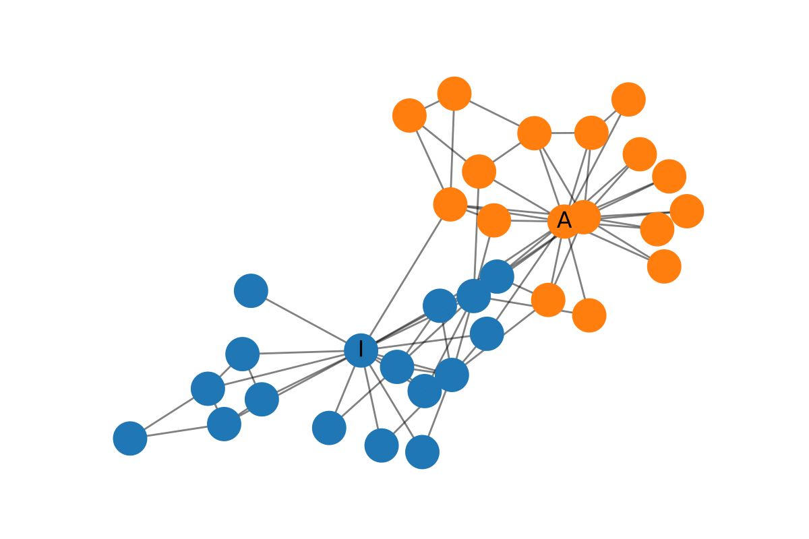

# RNN and LSTM

## Programming
We can apply a graph convolutional network on a real graph, Zachary’s Karate Club. Zachary’s karate club is a commonly used social network where nodes represent members of a karate club and the edges their mutual relations. While Zachary was studying the karate club, a conflict arose between the administrator and the instructor which resulted in the club splitting in two. The figure below shows the graph representation of the network and nodes are labeled according to which part of the club. The administrator and instructor are marked with ‘A’ and ‘I’, respectively.

You can use the following codes to get the dataset:

```python
from networkx import karate_club_graph
zkc = karate_club_graph()
```

Design a GNN to separate communities in Zachary’s Karate Club. We here use just the identity matrix as input representation, that is, each node is represented as a one-hot encoded variable. Show the final output feature representations for the nodes of Figure. 

**Hint:** Please try a GCN with two hidden layers just like (e), and initialize the weights randomly, then extract the feature representations and plot them. You will find even randomly initialized GCNs can separate communities in Zachary’s Karate Club. Next, you can try your own GNN for better performance.

## Programming: Natural language processing(NLP)
\url{https://pytorch.org/tutorials/index.html}

Please install \href{https://pytorch.org/} {PyTorch}, \href{https://jupyter.org/install} {Jupyter Notebook} and run the \href{https://pytorch.org/tutorials/_downloads/a60617788061539b5449701ae76aee56/seq2seq_translation_tutorial.ipynb} {NLP tutorial}. If you want to use TensorFlow or other deep learning frameworks, please find corresponding language translation tutorial for that framework and run it.

The tutorial is the third example for NLP From Scratch in Pytorch tutorials, where we write our own classes and functions to preprocess the data to do NLP modeling tasks. We hope after you complete this tutorial that you’ll proceed to learn how torchtext can handle much of this preprocessing for you in the three tutorials immediately following this one. In this project we will be teaching a neural network to translate from French to English. The code is given as a jupyter notebook file. 

All you need to do is to read, run and think. You need not to write any code or any report in this programming.

